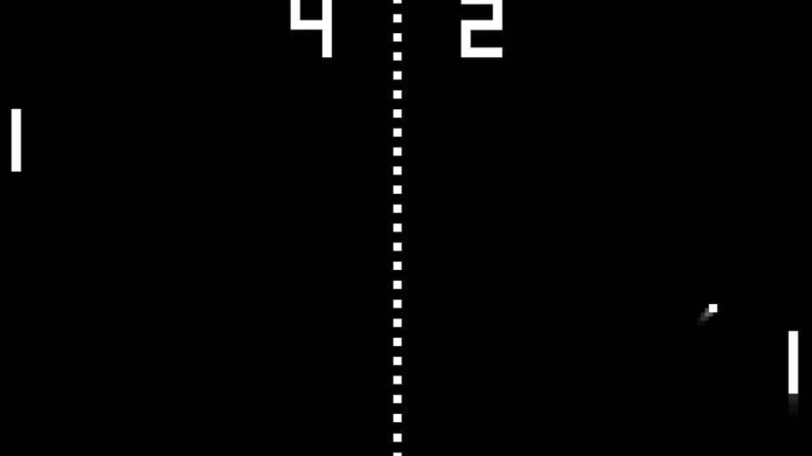

# Pong
L'objectif est de programmer une reproduction la plus fidèle possible au jeux vidéo célèbre Pong.

(voir l'image ci-dessous).

## Historique
Pong est un des premiers jeux vidéo d'arcade et le premier jeu vidéo d'arcade de sport. Il a été imaginé par l'Américain Nolan Bushnell et développé par Allan Alcorn, et la société Atari le commercialise à partir de novembre 1972.

## Notes sur la réalisation du projet
- L'integration est faite sur l'éditeur ZeroBraneStudio prenant directement en charge des interpreteurs utilisés pour coder du jeux vidéo.
- le langage de programmation utilisé est le Lua qui est un relativement simple à utilisé et qui s'apprend en quelques heures seulement. Il est surtout utilisé pour coder du jeux vidéo
- Le projet est composé d'un fichier unique nommé "main.lua" prenant en considération l'ensemble du code permettant de faire fonctionné le jeu.

## Screenshots

## Système de jeu
- Pong se veut etre une simulation de tennis de table ou ping-pong. Une balle, représentée par un petit carré blanc, se déplace à travers l'écran et rebondit sur les rebords du haut et du bas. 
- Les deux joueurs commandent chacun une raquette, représentée par un trait vertical aux extrémités gauche et droite du terrain de jeu.
- Le joueur déplace cette raquette en la faisant glisser verticalement entre les extrémités de l'écran à l'aide des contrôles. Si la balle frappe la raquette, elle rebondit vers l'autre joueur. Si elle manque la raquette, l'autre joueur marque un point.

## Commandes de jeu
- Le joueur 1 (raquette de gauche) déplace sa raquette en utilisant la touche A du clavier pour diriger sa raquette vers le haut et la touche Q pour diriger sa raquette vers le bas
- Le joueur 2 (raquette de droite) déplace sa raquette en utilisant la flèche directionnelle haut du clavier pour diriger sa raquette vers le haut et la flèche directionnelle bas du clavier pour diriger sa raquette vers le bas

## Notes
Il s'agit présentement de la v1 du jeux. A l'avenir, des améliorations seront apportées afin de se rapprocher du rendu final, autant visuel (un affichage du score fidèle au jeu original) que du point de vue des mécaniques de jeu (comme la prise de vitesse progressive de la balle).